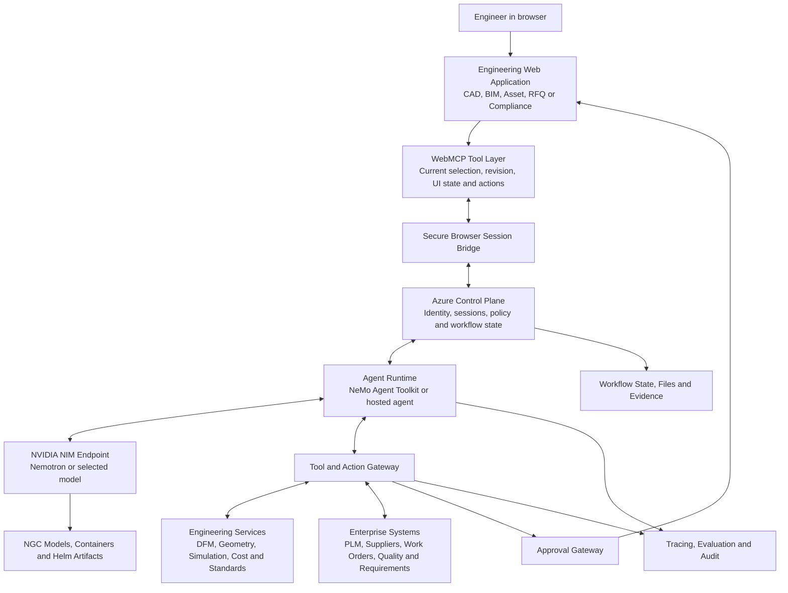
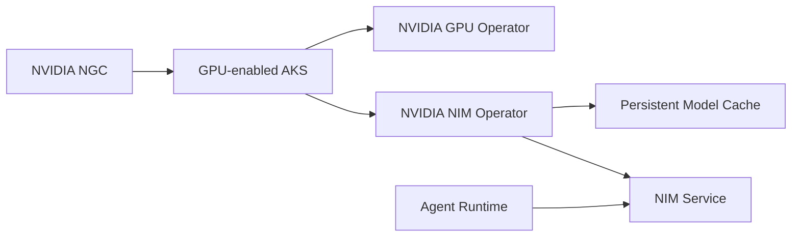

# Project Architecture — WebMCP Engineering Agent on NVIDIA + Azure

> Exported from [the canonical Notion page](https://app.notion.com/p/3ccf393aa76881f3a37bc9afe2949502) on 2026-08-30. This repository copy is a point-in-time snapshot.

> **Status: Proposed architecture**
> This page captures the current technical direction for a WebMCP-native physical-engineering agent using NVIDIA NGC, NVIDIA NIM, NeMo Agent Toolkit, NVIDIA OpenShell, and Microsoft Azure. It is intended to evolve after the first product workflow is selected.
## Architecture thesis
The system is not simply a chatbot attached to an engineering webpage.
> **AI plans the investigation → WebMCP connects it to live browser context → domain tools calculate and verify → the engineer authorizes consequential actions.**
WebMCP is the contextual front door. NVIDIA NIM provides model inference. The agent runtime coordinates the workflow. Azure hosts the control plane, applications, storage, identity, and operations. Deterministic engineering services provide the evidence required for trustworthy physical-world decisions.
# 1. System context
## Functional requirements
- Understand the exact engineering object, revision, configuration, selection, filters, and pending changes visible in the browser
- Plan and execute multi-step engineering workflows
- Invoke structured WebMCP tools in the active webpage
- Invoke backend MCP services, APIs, databases, and engineering computation
- Produce evidence-backed recommendations
- Preview consequential changes before execution
- Require human authorization for design, production, compliance, and financial actions
- Resume long-running work after tool failures or interruptions
- Record a complete trace of context, evidence, decisions, approvals, and actions
## Non-functional requirements
- Protect unreleased designs and supplier data
- Maintain revision consistency throughout a workflow
- Isolate risky execution
- Minimize GPU idle cost
- Support repeatable evaluation
- Keep model, agent, tools, and domain services independently replaceable
- Allow managed Azure deployment initially and greater AKS control later
# 2. High-level architecture

## Simplified responsibility model
<table fit-page-width="true" header-row="true">
<tr>
<td>Layer</td>
<td>Responsibility</td>
<td>Candidate technology</td>
</tr>
<tr>
<td>Browser application</td>
<td>Human interface, current engineering context, previews and approvals</td>
<td>Web application with 3D/BIM/asset viewer</td>
</tr>
<tr>
<td>WebMCP</td>
<td>Typed browser-native tools bound to live page state</td>
<td>document.modelContext tools</td>
</tr>
<tr>
<td>Browser bridge</td>
<td>Connect cloud agent run to the correct user, tab and WebMCP registry</td>
<td>Browser agent host, extension, embedded panel or secure session broker</td>
</tr>
<tr>
<td>Control plane</td>
<td>Identity, sessions, delegation, policies, workflow state and routing</td>
<td>Microsoft Azure</td>
</tr>
<tr>
<td>Agent runtime</td>
<td>Planning, tool selection, recovery, explanation and workflow coordination</td>
<td>NeMo Agent Toolkit or Microsoft Foundry hosted agent</td>
</tr>
<tr>
<td>Inference</td>
<td>Language and multimodal model execution</td>
<td>NVIDIA NIM</td>
</tr>
<tr>
<td>NVIDIA artifact source</td>
<td>Models, containers, Helm charts and optimized software</td>
<td>NVIDIA NGC</td>
</tr>
<tr>
<td>Container orchestration</td>
<td>Deployment, scaling, GPU scheduling, storage and health</td>
<td>AKS or Microsoft Foundry managed compute</td>
</tr>
<tr>
<td>Secure execution</td>
<td>Filesystem, process, network and model-access isolation</td>
<td>NVIDIA OpenShell</td>
</tr>
<tr>
<td>Domain truth</td>
<td>Geometry, DFM, simulation, cost, standards and revision calculations</td>
<td>Deterministic engineering services</td>
</tr>
<tr>
<td>Operations</td>
<td>Tracing, monitoring, evaluation and audit</td>
<td>OpenTelemetry, Application Insights, Foundry and NeMo evaluation</td>
</tr>
</table>
# 3. The critical browser-to-cloud bridge
> **Main architectural gap:** WebMCP tools live inside the user's webpage and authenticated browser session. A NIM-powered agent running in Azure cannot invoke them unless a secure browser-session bridge exists.
The bridge must:
1. Associate an agent run with the correct user, browser tab, origin, and page instance.
2. Discover the tools registered by that page.
3. Send structured tool invocations to the browser.
4. Return structured results to the cloud agent.
5. Show proposed state changes in the visible user interface.
6. Obtain required user confirmation.
7. Cancel or reject actions when the page, revision, configuration, or session becomes stale.
8. Prevent one site or agent session from accessing another site's tools or data.
## Candidate implementations
- **Embedded agent panel:** The engineering application itself hosts the agent UI and session connection. Best initial option because application and WebMCP state are under our control.
- **Browser extension:** Connects the active tab to the cloud agent. More general, but introduces distribution, permission, and security complexity.
- **Browser-native agent host:** Cleanest future architecture when supported, but availability depends on browser implementation.
- **Secure WebSocket broker:** Routes tool calls to the correct active page; still requires browser-side code or host integration.
# 4. NVIDIA stack responsibilities
## NVIDIA NGC
Use NGC for NVIDIA NIM images, model artifacts, Helm charts, GPU and NIM Operators, and versioned NVIDIA dependencies. Use Azure Container Registry for project-owned application containers where convenient. NGC is the NVIDIA artifact source, not the container orchestrator.
## NVIDIA NIM
NIM is the optimized inference service, not the workflow engine. Keeping it separate allows independent model upgrades, separate inference scaling, model routing, alternative-model evaluation, and portability between Foundry and AKS.
## NeMo Agent Toolkit
Proposed responsibilities:
- Agent workflow composition
- Tool integration
- Multi-step planning
- Profiling
- Repeatable evaluation
- Model and configuration comparison
- OpenTelemetry-compatible traces
## NVIDIA OpenShell
Use OpenShell around risky execution such as opening untrusted design packages, running generated scripts, invoking local engineering utilities, processing supplier files, accessing sensitive files, or calling external networks from an autonomous tool. Apply explicit filesystem, process, network, and inference policies.
# 5. Azure deployment architecture
## Option A — Managed-first prototype
> **Recommended for the first build:** Maximize product and WebMCP progress before investing heavily in Kubernetes operations.
<table fit-page-width="true" header-row="true">
<tr>
<td>Component</td>
<td>Recommended Azure service</td>
</tr>
<tr>
<td>Web frontend</td>
<td>Azure Static Web Apps or Container Apps</td>
</tr>
<tr>
<td>Agent runtime</td>
<td>Microsoft Foundry Agent Service or Container Apps</td>
</tr>
<tr>
<td>NIM model endpoint</td>
<td>Microsoft Foundry managed compute</td>
</tr>
<tr>
<td>Browser session broker</td>
<td>Container Apps with a persistent secure connection</td>
</tr>
<tr>
<td>Domain tools</td>
<td>Container Apps or Functions</td>
</tr>
<tr>
<td>Long-running workers</td>
<td>Container Apps workers triggered through Service Bus</td>
</tr>
<tr>
<td>Identity</td>
<td>Microsoft Entra ID and managed identities</td>
</tr>
<tr>
<td>Secrets</td>
<td>Azure Key Vault</td>
</tr>
<tr>
<td>Designs and evidence</td>
<td>Azure Blob Storage</td>
</tr>
<tr>
<td>Workflow state</td>
<td>PostgreSQL or Cosmos DB</td>
</tr>
<tr>
<td>Observability</td>
<td>Application Insights, Azure Monitor and OpenTelemetry</td>
</tr>
</table>
### Advantages
- Fastest route to an end-to-end demonstration
- Managed scaling, health, identity, and observability
- Lower operational burden
- Easier iteration on the WebMCP workflow
### Trade-offs
- Less control over GPU infrastructure
- Some managed features may remain in preview
- Less visible use of Kubernetes and the NIM Operator
## Option B — NIM on AKS

### Advantages
- Full control over NIM containers and GPU scheduling
- Portable Kubernetes deployment
- Custom networking, storage and scaling
- Strong demonstration of NGC, NIM and NVIDIA operators
### Trade-offs
- GPU quota and regional availability
- Higher idle cost
- More infrastructure and security work
- Persistent model-cache and cold-start management
- Risk of spending the project on Kubernetes instead of the engineering workflow
## Recommended hybrid evolution
- **Version 1:** Managed Azure web, agent and NIM deployment.
- **Version 2:** Move NIM and compute-heavy engineering workers to AKS.
- **Version 3:** Add autoscaling, model routing, tenant isolation and edge execution only when usage justifies them.
# 6. End-to-end request flow
Example request: **“Reduce the manufacturing cost of the selected bracket for 1,000 units.”**
1. The browser application exposes the selected bracket, revision, configuration, material, tolerances, and unsaved state through WebMCP.
2. The session bridge binds that page context to a new workflow run.
3. The control plane verifies user identity and grants read-only discovery scopes.
4. The agent calls NIM to interpret the goal and form a plan.
5. The agent invokes WebMCP tools to retrieve the current design context.
6. The tool gateway invokes deterministic DFM and geometry checks.
7. Supplier and cost services generate normalized manufacturing options.
8. The agent synthesizes the evidence and proposes bounded parameter changes.
9. The browser shows the modifications, cost impact, risks, and evidence.
10. The user approves or rejects consequential actions.
11. Approved actions execute with revision preconditions.
12. The system records the result, model version, tool versions, evidence, approval, and final revision.
# 7. Tool architecture
## WebMCP tools in the design application
- get_active_design_context
- get_selected_component
- get_selected_features
- get_current_revision
- get_visible_configuration
- get_unsaved_parameter_changes
- compare_revisions
- inspect_bom
- preview_parameter_change
- prepare_design_review
- submit_for_approval
## Supplier and manufacturing tools
- create_quote
- upload_design_package
- select_process
- select_material_and_finish
- get_dfm_feedback
- get_price_breaks
- get_lead_time
- revise_quote
- submit_order
## Approval and traceability tools
- create_change_record
- attach_evidence
- request_approval
- get_approval_status
- record_decision
## Domain services
- Geometry and topology inspection
- DFM rule evaluation
- BOM and revision diff
- Material and standard-component lookup
- Manufacturing cost estimation
- Supplier quote normalization
- Optional FEA, CFD or kinematic simulation
- Compliance evidence mapping
## Programs, websites, tools and resources
> **Compatibility rule:** WebMCP is the browser-context layer, not a universal connector. A product belongs in the architecture only through a verified WebMCP surface, official MCP server, supported API, controlled file exchange, or an explicit user-operated step. The roadmap below is a target map, not a claim that every named service currently supports WebMCP.
### Controlled hackathon applications
These are the most reliable places to demonstrate the complete workflow because we own the interface and the WebMCP tool definitions.
- **BuildReady Design Workspace:** browser-based CAD/3D viewer, selected-part context, revision state, BOM, design parameters and agent side panel.
- **Manufacturing Portal A:** CNC-oriented quoting, process/material choices, DFM feedback, price breaks and lead time.
- **Manufacturing Portal B:** additive or sheet-metal alternative for supplier comparison and quote normalization.
- **Review and Release Workspace:** evidence package, revision comparison, approval gates, decision log and release status.
### Priority real-world integrations
<table fit-page-width="true" header-row="true">
<tr>
<td>Layer</td>
<td>Recommended first choice</td>
<td>How it connects</td>
<td>Role</td>
<td>Status</td>
</tr>
<tr>
<td>CAD and product data</td>
<td>Onshape</td>
<td>In-tab app, REST API and a WebMCP companion surface we control</td>
<td>Model context, parameters, BOM, revisions and release workflow</td>
<td>Best first production target</td>
</tr>
<tr>
<td>Second CAD ecosystem</td>
<td>Autodesk Fusion</td>
<td>Official Fusion MCP for local design operations plus Fusion Data MCP/data services where appropriate</td>
<td>CAD/CAM operations, manufacturing context and design data</td>
<td>Second-wave integration</td>
</tr>
<tr>
<td>Simulation</td>
<td>SimScale or an open solver</td>
<td>Supported API/file workflow; CalculiX or OpenFOAM can run as controlled services</td>
<td>FEA/CFD evidence and result summaries</td>
<td>Start with one narrow analysis type</td>
</tr>
<tr>
<td>Manufacturing</td>
<td>Two controlled portals, then one partner/API</td>
<td>Direct WebMCP in demo portals; official API or partnership for a live supplier</td>
<td>DFM, quotes, lead time and supplier comparison</td>
<td>Do not depend on browser automation of an unsupported commercial site</td>
</tr>
<tr>
<td>Release management</td>
<td>BuildReady release record, then Onshape Release Management</td>
<td>Native WebMCP tools and supported product APIs</td>
<td>Approval gates, revision locking and traceability</td>
<td>Required from the MVP</td>
</tr>
<tr>
<td>Agent infrastructure</td>
<td>NVIDIA NIM + NeMo Agent Toolkit on Azure</td>
<td>Containerized services on Azure Container Apps or AKS</td>
<td>Reasoning, tool orchestration, retrieval, policy and observability</td>
<td>Core platform</td>
</tr>
</table>
### Broader ecosystem roadmap
- **CAD and design:** SolidWorks/3DEXPERIENCE, Creo, Siemens NX, CATIA and browser-accessible design portals.
- **Simulation and engineering analysis:** Ansys, Abaqus, Siemens Simcenter, MATLAB/Simulink, OpenFOAM and CalculiX.
- **Manufacturing and quoting:** Xometry, Protolabs, Fictiv, Hubs, RapidDirect, SendCutSend, PCBWay, JLCPCB and MacroFab.
- **Standard mechanical components:** McMaster-Carr, Grainger, MISUMI, Fastenal, RS and Bosch Rexroth.
- **Electronics sourcing:** DigiKey, Mouser, Arrow, Newark and Octopart.
- **Materials:** MatWeb, Ansys Granta, supplier datasheets and internal approved-material databases.
- **PLM/PDM:** Onshape Release Management, Autodesk Fusion Manage, Teamcenter, Windchill, Arena, Propel, 3DEXPERIENCE and SolidWorks PDM.
- **ERP/MES:** Microsoft Dynamics 365, SAP, Oracle, Odoo, NetSuite, Xometry Workcenter, JobBOSS, Katana and Fulcrum.
- **Collaboration and evidence:** SharePoint, Teams, OneDrive, Jira, Confluence, Notion, Azure DevOps, email and Slack.
### Integration priority
1. **Native WebMCP:** best for live browser context, selection state, previews and user-approved actions.
2. **Official MCP:** best when the product owner exposes stable, typed engineering operations.
3. **Official API:** best for durable records, revisions, jobs, quotes, files and event-driven workflows.
4. **Controlled file exchange:** STEP, Parasolid, STL, DXF, drawings, BOM/CSV and solver input/output files.
5. **Manual user action:** required when no authorized interface exists; the agent prepares the action and evidence but does not impersonate the user.
### Recommended implementation sequence
**Hackathon MVP**
- BuildReady Design Workspace with WebMCP.
- Two controlled supplier portals with WebMCP.
- Review/release workspace with approval gates.
- NVIDIA NIM and NeMo Agent Toolkit hosted on Azure.
- A deterministic DFM rules service.
- Optional lightweight stress check only if it improves the core demo.
**First real deployment**
- Onshape as the first CAD/product-data integration.
- SimScale or one open solver for a single validated analysis workflow.
- One manufacturing platform reached through an authorized API or partnership.
- BuildReady release records plus Onshape release integration.
**Second wave**
- Autodesk Fusion MCP and Fusion Data MCP.
- Component and material catalogs.
- A production PLM connection such as Fusion Manage or Arena.
- A deeper manufacturing integration such as Xometry if access is available.
**Longer term**
- SolidWorks/3DEXPERIENCE, Teamcenter, Windchill/Creo and Ansys.
- ERP/MES integration and closed-loop manufacturing feedback.
- Domain-specific extensions for electronics, BIM, field engineering and compliance.
### Technical resources
- [Onshape API documentation](https://onshape-public.github.io/docs/)
- [Onshape app development](https://onshape-public.github.io/docs/app-dev/)
- [Autodesk Fusion MCP overview](https://help.autodesk.com/view/fusion360/ENU/?guid=FMCP-OVERVIEW)
- [Xometry developer documentation](https://developer.xometry.com/docs/getting-started)
- [Xometry manufacturing platform](https://www.xometry.com/get-started/)
- [SimScale API and engineering workflow example](https://explore.simscale.com/hubfs/resources/whitepaper/Whitepaper-EngineeringDesignSimulationShapeOptimization-OnshapeSimScaleESTECO.pdf)
# 8. Identity, authorization and safety
## Identity model
The system must distinguish:
- **User identity:** Engineer or reviewer
- **Agent identity:** Executing agent instance
- **Tool identity:** Web application or backend service
- **Workflow identity:** Specific bounded run
A logged-in user session is not automatic permission for an agent to exercise every user capability.
## Proposed scopes
- design:read
- design:propose-change
- design:modify
- quote:create
- quote:submit
- order:place
- change:prepare
- release:approve
## Action classes
<table fit-page-width="true" header-row="true">
<tr>
<td>Class</td>
<td>Example</td>
<td>Default handling</td>
</tr>
<tr>
<td>Read</td>
<td>Inspect selected part</td>
<td>Automatic within authorized scope</td>
</tr>
<tr>
<td>Analyze</td>
<td>Run DFM check</td>
<td>Automatic within compute budget</td>
</tr>
<tr>
<td>Prepare</td>
<td>Draft engineering change</td>
<td>Automatic, no commit</td>
</tr>
<tr>
<td>Modify</td>
<td>Change a model parameter</td>
<td>Preview and explicit approval</td>
</tr>
<tr>
<td>Commit</td>
<td>Release a design</td>
<td>Strong confirmation and role check</td>
</tr>
<tr>
<td>Financial</td>
<td>Place an order</td>
<td>Strong confirmation, role and spending limit</td>
</tr>
</table>
## Required controls
- Read-only discovery by default
- Short-lived, least-privilege credentials
- Revision locking and stale-context detection
- Tool origin and publisher provenance
- Allowlisted network destinations
- Full action and approval audit
- Redaction of designs, credentials, and supplier data from telemetry
- Cost, token, time, and action budgets
- Reversible changes where possible
- Qualified human sign-off for safety and compliance
# 9. Data and state model
Every consequential operation should carry:
- tenant_id
- user_id
- agent_id
- workflow_run_id
- browser_session_id
- origin
- design_or_asset_id
- revision_id
- configuration_id
- tool_schema_version
- model_version
- requested_action
- evidence_references
- approval_status
- final_result
Before committing, compare the current revision and configuration to the values analyzed by the agent. A mismatch invalidates the proposal and requires re-analysis.
# 10. Reliability and asynchronous work
The workflow engine must persist:
- Current stage
- Completed and failed tool calls
- Retry count
- Deadlines and timeouts
- Approval state
- Model and tool versions
- Revision preconditions
- Evidence artifacts
- Final disposition
Use a queue for simulations, large geometry processing, quote collection, and other long-running tasks. Tool calls should be idempotent where possible. State-changing tools should accept an idempotency key and revision precondition.
# 11. Observability and evaluation
## Operational tracing
Capture model invocations, tool names and versions, sanitized arguments and results, latency, failures, user approvals, revision changes, and token/compute cost. Use OpenTelemetry as the shared trace format, with Application Insights and Microsoft Foundry for inspection.
## Workflow evaluation
Measure:
- Correct selected-object identification
- Correct tool choice
- DFM issue recall and false alarms
- Change-impact completeness
- Unsafe action attempts
- Approval bypass attempts
- Recovery after tool failure
- Stale-revision rejection
- Task completion rate
- Cost and latency per completed workflow
Use NeMo Agent Toolkit for repeatable datasets and custom domain evaluators. Run regression evaluations whenever the model, prompt, tool schema, or domain rules change.
# 12. Cost and scaling strategy
- Scale CPU agent orchestration separately from GPU inference
- Use a smaller model for classification and routing where appropriate
- Escalate to a larger model for complex reasoning
- Persist NIM model artifacts to reduce cold starts
- Limit workflow concurrency and compute budgets
- Cache deterministic results by design revision and rule version
- Prefer managed inference during early development
- Move to dedicated AKS GPU capacity when sustained utilization justifies it
# 13. Decisions made so far
- [x] Build for physical-engineering workflows rather than software-engineering agents.
- [x] Make WebMCP central to live browser state and visible actions.
- [x] Use NVIDIA NIM for inference and NGC for NVIDIA artifacts.
- [x] Prefer Microsoft Azure for hosting and enterprise controls.
- [x] Separate model inference from agent orchestration.
- [x] Use deterministic engineering validators as calculated truth.
- [x] Keep consequential actions behind human approval.
- [x] Use a managed-first deployment unless AKS control is required for the demonstration.
# 14. Open architecture decisions
- [ ] Select the first product workflow: RFQ/DFM, engineering change, maintenance, BIM coordination, or certification.
- [ ] Decide whether the agent runtime is NeMo Agent Toolkit, Foundry Agent Service, or a hybrid.
- [ ] Choose the initial NIM/Nemotron model based on tool use, latency, GPU requirement, and license.
- [ ] Decide whether the first deployment uses managed Foundry NIM or NIM on AKS.
- [ ] Choose the browser bridge: embedded panel, extension, or browser-native host.
- [ ] Select the initial 3D/engineering data representation and viewer.
- [ ] Identify deterministic checks that will ship in version one.
- [ ] Define the first approval policy and state-changing action.
- [ ] Confirm Builders Arcade submission requirements and required NVIDIA technologies.
# 15. Recommended initial build slice
> **Suggested prototype:** A WebMCP-enabled design workspace plus a supplier quoting portal. The agent identifies the selected part, runs deterministic DFM checks, compares manufacturing options, proposes a bounded change, and produces a release-readiness package after user approval.
This slice proves:
- Live WebMCP page context
- Cross-site workflow orchestration
- NVIDIA NIM inference
- Azure hosting
- Deterministic engineering evidence
- Human approval and audit
- A measurable physical-engineering outcome
# 16. Hackathon-constrained MVP execution plan
> **Frozen MVP:** BuildReady is a WebMCP-powered manufacturing-readiness workspace in which an engineer and an AI agent inspect one CNC component, identify manufacturability problems, preview a bounded correction, compare two controlled supplier options, and produce a review package. The engineer retains final authority.
## 16.1 Why the scope is constrained
The hackathon version must prove one complete and reliable workflow before expanding into live CAD, simulation, PLM or commercial supplier integrations. The primary judge path must work without an Onshape, NVIDIA or supplier account. Onshape remains the first production CAD target, but it cannot be a dependency for evaluating the MVP.
## 16.2 Demonstration component
Use one preconfigured **CNC-machined bracket** with intentionally embedded manufacturing issues:
- Internal corner radius smaller than the selected cutting tool
- Pocket depth that is excessive relative to pocket width
- Thin wall susceptible to machining deflection
- Excessive hole depth-to-diameter ratio
- One unnecessarily tight tolerance
The primary correction is a change to the internal corner radius. This gives the demonstration a visually clear before-and-after state while keeping the engineering rule deterministic.
## 16.3 Judge experience
The complete judge journey should take approximately 90 seconds:
1. Open the public BuildReady URL.
2. Load the preconfigured CNC bracket automatically with no login or setup.
3. Ask ChatGPT: *“Inspect this design and prepare it for CNC manufacturing.”*
4. Allow ChatGPT to discover and invoke the page’s WebMCP tools.
5. Read the active design context and run deterministic CNC DFM checks.
6. Highlight detected issues on the model and explain them with measurements.
7. Prepare a safer internal-corner-radius change.
8. Preview the change and require explicit engineer approval.
9. Compare results from two controlled WebMCP supplier experiences.
10. Generate a manufacturing-readiness review package containing findings, decisions, quotes and approval evidence.
## 16.4 MVP WebMCP tool surface
### BuildReady design workspace
<table fit-page-width="true" header-row="true">
<tr>
<td>Tool</td>
<td>Purpose</td>
</tr>
<tr>
<td>get_active_design_context</td>
<td>Read the part, material, process, revision and selected feature.</td>
</tr>
<tr>
<td>inspect_cnc_manufacturability</td>
<td>Run deterministic CNC checks and return structured evidence.</td>
</tr>
<tr>
<td>get_manufacturing_issue_details</td>
<td>Explain one issue and highlight its affected feature.</td>
</tr>
<tr>
<td>preview_parameter_change</td>
<td>Preview a bounded correction without silently applying it.</td>
</tr>
<tr>
<td>prepare_supplier_comparison</td>
<td>Prepare the design context for two controlled supplier experiences.</td>
</tr>
<tr>
<td>generate_review_package</td>
<td>Compile findings, decisions, quotes and approval records.</td>
</tr>
</table>
### Controlled supplier experiences
- get_cnc_quote
- get_dfm_feedback
- get_lead_time
- get_price_breaks
The supplier experiences may be separate routes or subdomains under the controlled deployment. They must use real WebMCP tool registration and deterministic fixture data rather than unsupported automation of commercial websites.
## 16.5 Human authority boundary
### The agent may
- Read the active design context
- Analyze manufacturing features
- Explain problems and consequences
- Recommend parameter values
- Generate a non-destructive preview
- Prepare supplier requests
- Compare normalized responses
- Compile a review package
### The agent may not
- Apply a design change without approval
- Change a protected requirement
- Release a revision
- upload geometry to a real third party
- Submit a real purchase or order
Approval occurs through a clear in-application confirmation. The evidence package records the proposed action, decision and rationale.
## 16.6 Simplified implementation architecture
1. **Judge-facing client:** ChatGPT in-app browser or WebMCP-enabled Chrome.
2. **Web application:** React and TypeScript BuildReady interface.
3. **Visualization:** Three.js parametric sample bracket with issue highlighting.
4. **Browser integration:** Native document.modelContext.registerTool(...) registrations.
5. **Engineering service:** Python FastAPI with deterministic CNC rules.
6. **AI services:** NVIDIA NIM for grounded explanations and synthesis; NeMo Agent Toolkit for routing and tool policy.
7. **Hosting:** Azure Container Apps with a public HTTPS endpoint and server-side secrets.
8. **MVP data:** Controlled design, rule and quote fixtures. PostgreSQL and Blob Storage remain interface-compatible follow-ups rather than core dependencies.
## 16.7 Responsibility of NVIDIA and WebMCP
WebMCP remains the visible interaction protocol through which the external agent understands and operates the engineering web experiences. NVIDIA NIM provides specialized engineering explanation and synthesis behind the application. NIM must not replace or obscure the WebMCP interaction that judges evaluate.
Deterministic rule results remain the source of truth for measurements and violations. The model explains and organizes those results but must not invent geometry, dimensions or manufacturing evidence.
## 16.8 Explicitly deferred
- Required Onshape authentication or live model editing
- Real supplier APIs and quote submission
- Simulation or FEA
- Azure Database for PostgreSQL
- Azure Blob Storage
- PLM/PDM and ERP/MES integrations
- Multiple parts or manufacturing processes
- Autonomous design changes
- Real purchasing
- Production compliance claims
**First stretch goal:** Add an optional Onshape connector after the complete judge-safe path works. The sample design remains available as a fallback.
## 16.9 Sequenced build plan
### Stage 1 — Functional WebMCP foundation
- Initialize the repository and add the open-source license.
- Build the application shell and sample-part state.
- Register the first two WebMCP tools.
- Test discovery and execution in ChatGPT’s in-app browser.
**Checkpoint:** ChatGPT can read the loaded part and selected feature.
### Stage 2 — CNC analysis
- Create the visual sample bracket and feature metadata.
- Implement five deterministic DFM rules.
- Highlight findings in the viewer.
- Return structured evidence through WebMCP.
**Checkpoint:** Identical inputs produce correct and explainable findings.
### Stage 3 — Change preview and approval
- Implement the internal-radius correction.
- Present before-and-after measurements.
- Require explicit approval and record approval or rejection.
- Prevent unauthorized application.
**Checkpoint:** The agent can prepare a change but cannot silently apply it.
### Stage 4 — Supplier workflow
- Build two controlled supplier experiences.
- Register quote and DFM tools.
- Return differing price, lead-time and feedback fixtures.
- Normalize results into one comparison.
**Checkpoint:** The design-to-supplier journey works through registered WebMCP tools.
### Stage 5 — NVIDIA integration
- Add NIM-backed engineering explanations.
- Ground responses in deterministic rule output.
- Add NeMo routing or policy enforcement.
- Test failure behavior when the model service is unavailable.
**Checkpoint:** NIM improves explanation without becoming the source of engineering measurements.
### Stage 6 — Deployment and submission readiness
- Deploy to Azure with a public HTTPS URL.
- Test with no developer account or hidden local dependency.
- Test all tools in ChatGPT’s in-app browser and WebMCP-enabled Chrome.
- Add judge prompts, testing instructions and expected results.
- Publish the repository, README and license.
- Record a public YouTube demonstration under three minutes.
- Verify the entire journey in a clean browser session.
## 16.10 Definition of done
The MVP is complete only when:
- The public URL works without developer assistance.
- ChatGPT discovers and invokes the registered WebMCP tools.
- Five CNC issues are detected correctly.
- At least one correction can be previewed and explicitly approved.
- The agent cannot bypass approval.
- Two controlled supplier results can be compared.
- A review package is generated.
- NIM explanations remain grounded in deterministic evidence.
- The demonstration completes in under two minutes.
- The public repository contains functional source, setup instructions and an open-source license.
## 16.11 MVP success measurements
**Primary**
- Time from selecting the sample revision to a complete manufacturing-readiness package.
**Supporting**
- Number of actionable issues found before quoting.
- Time required for the mechanical/manufacturing review.
- Percentage of findings supported by reproducible measurements.
- Number of manual handoffs eliminated.
- Number of agent actions with complete approval and traceability records.
## 16.12 Expansion order after the MVP works
1. Optional Onshape connection using the same internal design-context model.
2. Azure PostgreSQL and Blob Storage for durable projects, evidence and audit records.
3. One authorized manufacturing-platform API.
4. One narrow simulation workflow.
5. Production release-management integration.
6. Additional processes, components and enterprise systems.
# Related project pages
- [WebMCP & Autonomous Agents — Project Hub](https://app.notion.com/p/3cbf393aa76881f18e5ac14ed6e6f8af)
- [Physical Engineering + WebMCP — Opportunity Brainstorm](https://app.notion.com/p/3cbf393aa7688154a390e55e235b29ba)
- [WebMCP, MCP & AI Agents — Research and Opportunity Landscape](https://app.notion.com/p/3cbf393aa76881abaf86d7bf00b7417b)
# Technical references
- [W3C WebMCP draft](https://webmachinelearning.github.io/webmcp/)
- [Chrome WebMCP documentation](https://developer.chrome.com/docs/ai/webmcp)
- [NVIDIA NIM deployment on Azure](https://docs.nvidia.com/nim/large-language-models/latest/deployment/csp-deployment/azure.html)
- [NVIDIA NIM Operator](https://docs.nvidia.com/nim/large-language-models/latest/deployment/kubernetes-deployment/nim-operator-deployment.html)
- [NVIDIA NGC documentation](https://docs.nvidia.com/ngc/index.html)
- [NVIDIA NeMo Agent Toolkit evaluation](https://docs.nvidia.com/nemo/agent-toolkit/latest/workflows/evaluate.html)
- [NVIDIA OpenShell](https://docs.nvidia.com/openshell/about/overview)
- [Microsoft Foundry deployment options](https://learn.microsoft.com/en-us/azure/foundry/concepts/deployments-overview)
- [Microsoft Foundry Agent Service](https://learn.microsoft.com/en-us/azure/ai-foundry/agents/overview)
- [Microsoft Foundry agent tracing](https://learn.microsoft.com/en-us/azure/foundry/observability/concepts/trace-agent-concept)
---
**Architecture captured:** August 29, 2026
**Review trigger:** Update after selecting the first engineering workflow, browser bridge, agent runtime, and deployment path.
